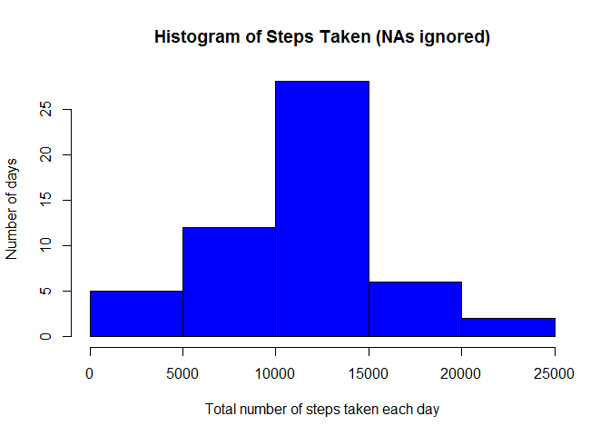
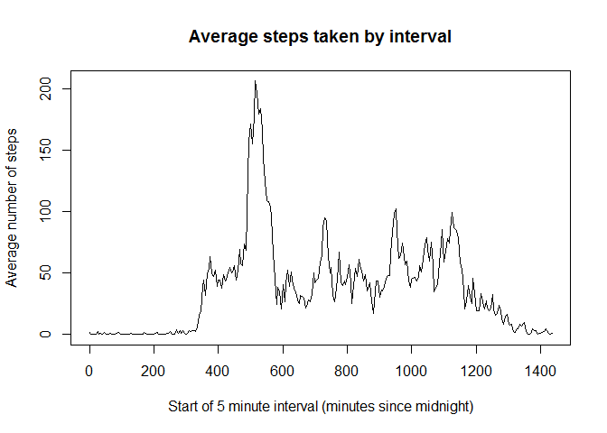
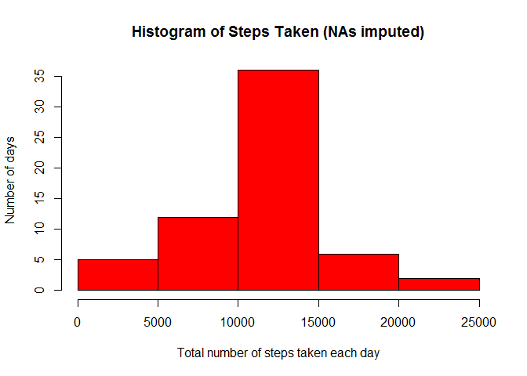
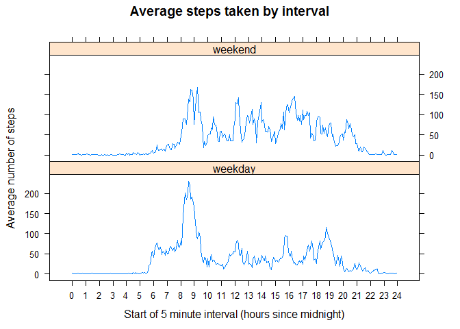

# Reproducible Research: Peer Assessment 1


## Loading and preprocessing the data

The data is contained in a ZIP file, "activity.zip", which I have assumed is saved in the working directory. We load the data by unzipping this file to create a file "activity.csv" and then reading it into R:

```r
unzip("./activity.zip", files = NULL)
activity <- read.csv("activity.csv")
```
Viewing the first few lines of the data and looking at its structure confirms that the data has been loaded successfully:

```r
head(activity)
```

```
##   steps       date interval
## 1    NA 2012-10-01        0
## 2    NA 2012-10-01        5
## 3    NA 2012-10-01       10
## 4    NA 2012-10-01       15
## 5    NA 2012-10-01       20
## 6    NA 2012-10-01       25
```

```r
str(activity)
```

```
## 'data.frame':	17568 obs. of  3 variables:
##  $ steps   : int  NA NA NA NA NA NA NA NA NA NA ...
##  $ date    : Factor w/ 61 levels "2012-10-01","2012-10-02",..: 1 1 1 1 1 1 1 1 1 1 ...
##  $ interval: int  0 5 10 15 20 25 30 35 40 45 ...
```
However, the date column has been read as a factor variable. We convert this to date format:

```r
activity$date <- as.Date(activity$date) 
```
The interval column has been read as an integer variable. Let's look at it more closely by extracting the first thirty values:

```r
activity$interval[1:30]
```

```
##  [1]   0   5  10  15  20  25  30  35  40  45  50  55 100 105 110 115 120
## [18] 125 130 135 140 145 150 155 200 205 210 215 220 225
```
This shows that "interval" records the start of the 5 minute interval in the format "hhmm" where leading zeros are omitted. For example, the 12th row of data has interval "55" which corresponds to a start time of 00:55 and the 13th row has interval "100" which corresponds to a start time of 01:00. This will cause problems for the time series plots because they will show a 45 unit gap between these two readings whereas it should only be a 5 unit gap.

We can overcome this problem by converting the interval variable to the number of minutes since the start of the day. First we transform "interval" to a four digit character string with leading zeros where necessary; for example, 55 becomes "0055". We can then multiply the first two digits (hours) by sixty and add the second two digits (minutes) to get the number of minutes since midnight.

```r
activity$interval <- sprintf("%04d", activity$interval) #Adds leading zeros so that all intervals are four digits long
activity$interval <- as.integer(substr(activity$interval,1,2))*60 + as.integer(substr(activity$interval,3,4))
```

The data is now in a format suitable for our analysis.


## What is the mean total number of steps taken per day?
To study the total number of steps taken per day, we first need to calculate these totals:

```r
totalsteps <- aggregate(activity$steps, list(activity$date), sum)
str(totalsteps)
```

```
## 'data.frame':	61 obs. of  2 variables:
##  $ Group.1: Date, format: "2012-10-01" "2012-10-02" ...
##  $ x      : int  NA 126 11352 12116 13294 15420 11015 NA 12811 9900 ...
```
This dataframe has 61 observations of two variables: Group.1 (which gives the date) and x (which gives the total number of steps on that date). Each observation corresponds to one date in October or November 2012. There are 8 dates with missing values.

```r
sum(is.na(totalsteps$x))
```

```
## [1] 8
```
We can view the total number of steps per day using a histogram. The standard histogram plot automatically ignores the NA values.

```r
hist(totalsteps$x, col="blue", main="Histogram of Steps Taken (NAs ignored)", 
     xlab="Total number of steps taken each day", ylab="Number of days")
```

 

In order to calculate the mean and median number of steps per day, we need to set na.rm=TRUE so that missing values are ignored:

```r
mean_steps <- mean(totalsteps$x, na.rm=TRUE)
median_steps <- median(totalsteps$x, na.rm=TRUE)
```
The mean is 10766.2 steps per day and the median is 10765 steps per day.


## What is the average daily activity pattern?
In this section, we are interested in the number of steps taken in each 5 minute interval, averaged across the 61 days of the study. We therefore need to create another dataframe which aggregates the data differently:

```r
interval_av <- aggregate(activity$steps, list(activity$interval), function(x) mean(x,na.rm=TRUE))
str(interval_av)
```

```
## 'data.frame':	288 obs. of  2 variables:
##  $ Group.1: num  0 5 10 15 20 25 30 35 40 45 ...
##  $ x      : num  1.717 0.3396 0.1321 0.1509 0.0755 ...
```
This dataframe has 288 observations of two variables: Group.1 (which gives the interval) and x (which gives the average number of steps during that interval). We can now make a time series plot of the 5-minute interval (x-axis) and the average number of steps taken, averaged across all days (y-axis). 

```r
with(interval_av, plot(Group.1, x, type="l", main="Average steps taken by interval", 
                       xlab="Start of 5 minute interval (minutes since midnight)", 
                       ylab="Average number of steps"))
```

 

This plot shows that the 5-minute interval that contains the maximum number of steps, on average across all the days in the dataset, starts about 500-550 minutes after midnight. We can identify the exact 5-minute interval using the grepl command which returns a logical vector containing a single TRUE value corresponding to the maximum time, then extracting this single value from the interval column.

```r
maxtime <- grepl(max(interval_av$x),interval_av$x) 
interval_av$Group.1[maxtime]
```

```
## [1] 515
```
This tells us that the 5-minute interval with the maximum number of steps starts 515 minutes after midnight. This corresponds to the interval 08:35-08:39.


## Imputing missing values

We can calculate the total number of rows with missing values in the dataset by counting the number of cases that are not complete:

```r
sum(!complete.cases(activity))
```

```
## [1] 2304
```
We can verify that the missing values all appear in the steps column:

```r
sum(is.na(activity$steps))
```

```
## [1] 2304
```

```r
sum(is.na(activity$date))
```

```
## [1] 0
```

```r
sum(is.na(activity$interval))
```

```
## [1] 0
```
The 2304 missing steps values correspond to all 288 readings on 8 days of the study (2304/288=8). These are the 8 dates with missing values in the "total steps" dataframe used above.

One way of filling in these missing values is to assume that the number of steps in each interval was equal to the average for that interval of the day. We can create a new variable ("interval_av_rep") which contains the average number of steps for each interval repeated 61 times, corrresponding to the 61 dates of the study. We can then create a new dataframe "activity2" which is the same as "activity" but with all missing values replaced by the corresponding value from "interval_av_rep".

```r
interval_av_rep <- rep(interval_av$x,61)
activity2 <- activity
for (i in 1:nrow(activity2)) 
    if (is.na(activity2$steps[i]))
    {activity2$steps[i] = interval_av_rep[i]}
```
We can now calculate the total number of steps per day using this revised dataset and view them using a histogram. 

```r
totalsteps2 <- aggregate(activity2$steps, list(activity2$date), sum)
hist(totalsteps2$x, col="red", main="Histogram of Steps Taken (NAs imputed)", 
     xlab="Total number of steps taken each day", ylab="Number of days")
```

 

The mean and median can be calculated as follows:

```r
mean_steps2 <- mean(totalsteps2$x)
median_steps2 <- median(totalsteps2$x)
```
The mean is 10766.2 steps per day, the same as before. This is what we would expect given that we've used the mean number of steps to fill in the gaps (and the gaps correspond to whole days). The median is 10766.2 steps per day, which is a very slight increase from before. Hence imputing missing data has had very little impact on the estimates of the average total daily number of steps. The two histograms are similar as well; the only difference is that the second one has eight extra data points in the middle column.


## Are there differences in activity patterns between weekdays and weekends?

To answer this question, we need to create a new factor variable in the dataset with two levels - "weekday" and "weekend" - indicating whether a given date is a weekday or weekend day. We first add a variable which gives the day of the week. Then we replace each day with either "weekday" or "weekend" as appropriate. We use the revised dataset, with missing values imputed, for this section.

```r
activity2$day <- weekdays(activity2$date)
activity2$day <- gsub("Monday","weekday",activity2$day)
activity2$day <- gsub("Tuesday","weekday",activity2$day)
activity2$day <- gsub("Wednesday","weekday",activity2$day)
activity2$day <- gsub("Thursday","weekday",activity2$day)
activity2$day <- gsub("Friday","weekday",activity2$day)
activity2$day <- gsub("Saturday","weekend",activity2$day)
activity2$day <- gsub("Sunday","weekend",activity2$day)
```
Before we can compare the average pattern of steps at weekends and on weekdays using a panel plot, we need to group the data by interval for both weekends and weekdays, then calculate the average for each group.

```r
library(dplyr)
activity2_day <- group_by(tbl_df(activity2), day, interval) 
interval_av_day <- summarize(activity2_day, av_steps = mean(steps)) 
```
We can then create the panel plot using the lattice plotting system. We plot the average number of steps taken (y-axis) against the 5-minute interval (x-axis). The default settings label every interval on the x-axis which is impossible to read. We can change this by specifying the labels we want to use and the position of each label.

```r
library(lattice)
x_labels <- 0:24
x_position <- c(0,60,120,180,240,300,360,420,480,540,600,660,720,780,840,900,960,1020,1080,1140,1200,1260,1320,1380,1440)
xyplot(av_steps ~ interval | day, data = interval_av_day, type="l", layout = c(1, 2), 
       scales=list(x=list(at=x_position, labels=x_labels)), 
       xlab="Start of 5 minute interval (hours since midnight)", ylab="Average number of steps", 
       main="Average steps taken by interval")
```

 
